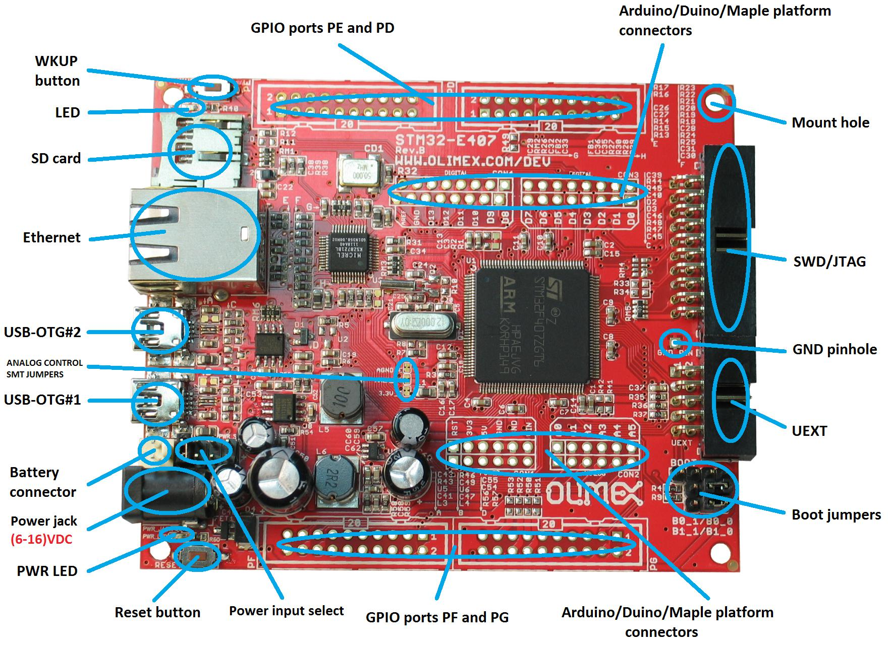
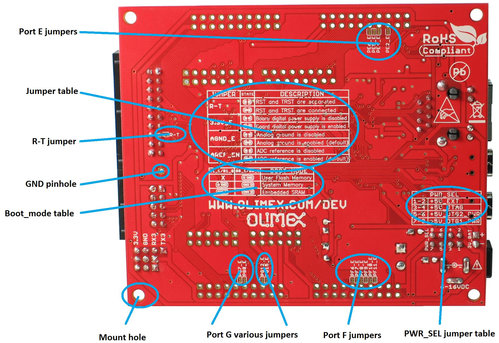
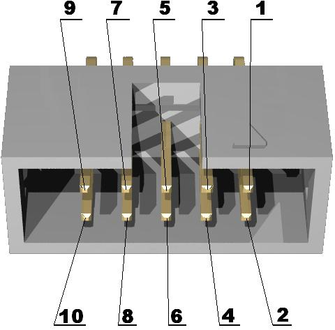

# S T M 3 2 - E 4 0 7    B L I N K

Hello World example for the [STM32-E407 board](https://www.olimex.com/Products/ARM/ST/STM32-E407/open-source-hardware) on [PlatformIO](https://platformio.org) with the Arduino framework. The upload is done with a USB cable and not with a JTAG programmer.

> This example works only if the STM32 platform version is 5.6.0 or higher. You can check the current version of this platform in your editor (VSCode on macOS for me), in the `PlatformIO Home / Platforms` pane. The STM32 platform is automatically installed by PlatformIO during the first build.
>
> This example didn’t work at first and the debugging story can be read here:
> <https://community.platformio.org/t/stm32-e407-doesn-t-work-on-pio/9303/13>
> and here: <https://www.olimex.com/forum/index.php?topic=7206.0>.
>
> During the debugging process, *maxgerhardt* forked this example and made an STM32Cube version of it (i.e. not using the Arduino framework). It works well and you can see it here: <https://github.com/maxgerhardt/STM32-E407-BLINK>.
>
> Thanks to *maxgerhardt* and *valeros* for their support.


## IMAGES

> Note that `USB-OTG#1` and `#2` are inverted on the image compared to the board I have. It seems that the images (from Olimex) are showing an older revision of the board.





## PREREQUISITES

### On macOS

- Install `libusb`, `lsusb` and `dfu-util` with [Homebrew](https://brew.sh). The library `libusb` is required. The other two are optional but can help in case of problems.

```bash
brew install libusb lsusb dfu-util
```

### On Ubuntu 18

- Install `99-platformio-udev.rules`:

```bash
curl -fsSL https://raw.githubusercontent.com/platformio/platformio-core/master/scripts/99-platformio-udev.rules | sudo tee /etc/udev/rules.d/99-platformio-udev.rules

sudo service udev restart
```

- Add current user to `dialout` and `plugdev` groups:

```bash
sudo usermod -a -G dialout $USER
sudo usermod -a -G plugdev $USER
```

- Reboot, plug the board USB connector and test that everything is OK with the command:

```bash
dfu-util --list
```


## SETUP

- Set the Power Selection jumper (PWR_SEL) to 7-8 (i.e. USB-OTG1 power supply). This jumper is located next to the power jack connector.

- Set the Boot Mode Selection jumpers. These jumpers are located on the back of the board, next to the UEXT connector:

```bash
B0_1/B0_0 ⇒ B0_1
B1_1/B1_0 ⇒ B1_0
````

- Connect the USB cable to USB-OTG1. This is the USB connector that is closest to the Ethernet connector. Note that the label is correct on the PCB but not on the image above!

- Optionally, verify that the card is detected with the bash command `lsusb` and `dfu-util --list`. If no card is detected, check the Boot Mode Selection jumpers and push the reset button next to the power jack connector.

```bash
lsusb
```
```bash
Bus 020 Device 015: ID 0483:df11 STMicroelectronics STM32  BOOTLOADER  Serial: 336032683536
```
```bash
dfu-util --list
```
```bash
dfu-util 0.9

Copyright 2005-2009 Weston Schmidt, Harald Welte and OpenMoko Inc.
Copyright 2010-2016 Tormod Volden and Stefan Schmidt
This program is Free Software and has ABSOLUTELY NO WARRANTY
Please report bugs to http://sourceforge.net/p/dfu-util/tickets/

Found DFU: [0483:df11] ver=2200, devnum=11, cfg=1, intf=0, path="20-1.4", alt=3, name="@Device Feature/0xFFFF0000/01*004 e", serial="336032683536"
Found DFU: [0483:df11] ver=2200, devnum=11, cfg=1, intf=0, path="20-1.4", alt=2, name="@OTP Memory /0x1FFF7800/01*512 e,01*016 e", serial="336032683536"
Found DFU: [0483:df11] ver=2200, devnum=11, cfg=1, intf=0, path="20-1.4", alt=1, name="@Option Bytes  /0x1FFFC000/01*016 e", serial="336032683536"
Found DFU: [0483:df11] ver=2200, devnum=11, cfg=1, intf=0, path="20-1.4", alt=0, name="@Internal Flash  /0x08000000/04*016Kg,01*064Kg,07*128Kg", serial="336032683536"
```

- Compile and upload the code with PlatformIO.

- The LED of the board located near the SD card slot and the Arduino LED (D13 on the board or PA5 in the sketch) should blink. Note that the program is executed right after the upload, but if you reset the board, it will be waiting for another upload and the program won’t run anymore. So for normal use, you need to set the Boot Mode Selection jumpers again:

```bash
B0_1/B0_0 ⇒ B0_0
B1_1/B1_0 ⇒ B1_0 (unchanged)
```

- During development, you can let the Boot Mode Selection jumpers unchanged, but you need to reset the board before upload. The reset button is located beside the power jack connector.


## SERIAL OUTPUT

Serial output is available from three different sources:

### SerialUSB

To read SerialUSB, you only need a USB cable connected to the USB-OTG#1 port, i.e. it is the same cable that we used to program the board.

For SerialUSB to work, the function `SystemClock_Config(void)` must be overridden by the one provided in this project. The original function can be found here: `~/.platformio/packages/framework-arduinoststm32/variants/BLACK_F407XX/variant.cpp` or here: `C:\Users\<home>\.platformio\packages\framework-arduinoststm32\variants\BLACK_F407XX\variant.cpp`.

For more explanations see: <https://community.platformio.org/t/stm32-e407-doesn-t-work-on-pio/9303/3>.

> Note that unlike the Arduino UNO and similar boards, a terminal showing the output of SerialUSB must be restarted manually each time the board is reset. This is quite annoying during development and you may prefer the other two serial ports below.

### Serial3

To read Serial3, you need to connect an UART Serial Bridge to the GND and TX pins of the BOOT header located beside the UEXT connector (the pin labels are on the back of the board).

### Serial6

To read Serial6, you need to connect an UART Serial Bridge to pin 2 (GND) and 3 (TX) of the UEXT connector.




## REFERENCES

- STM32-E407 development board with STM32F407ZGT6 microcontroller
  - https://www.olimex.com/Products/ARM/ST/STM32-E407/open-source-hardware
  - https://www.olimex.com/Products/ARM/ST/STM32-E407/resources/STM32-E407.pdf
- PlatformIO
  - https://docs.platformio.org/en/latest/boards/ststm32/black_f407zg.html
- dfu-util
  - http://dfu-util.sourceforge.net
- Question asked
  - https://github.com/platformio/platform-ststm32/issues/295
  - https://community.platformio.org/t/unknown-upload-protocol-olimex-arm-usb-ocd-h/9866
  - https://community.platformio.org/t/stm32-e407-doesn-t-work-on-pio/9303/27
  - https://www.olimex.com/forum/index.php?topic=7206.msg27434#msg27434
